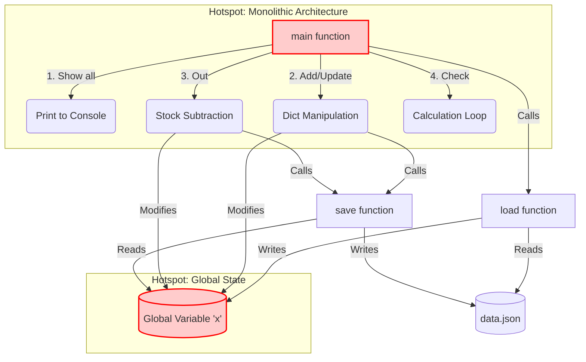

# Phase 2: System Refactoring and Project Management Report

**Project:** Inventory System v2.0

**Date:** `$$ ระบุวันที่ $$`

**Team Members:** `$$ ระบุชื่อสมาชิก $$`

---

## 1. ISO/IEC 25010 Software Quality Evaluation Checklist

การประเมินคุณภาพซอฟต์แวร์ตามมาตรฐาน ISO/IEC 25010 โดยเปรียบเทียบระหว่างระบบเดิม (As-Is / v1.0) และระบบที่ได้รับการปรับปรุง (To-Be / v2.0) ใน 5 มิติหลัก:

| Quality Characteristic | Checklist Item | Status v1.0 (As-Is) | Status v2.0 (To-Be) | Remarks (การปรับปรุง) |
|---|---|:---:|:---:|---|
| **1. Maintainability** | 1.1 โค้ดมีการแยกส่วนการทำงาน (Modularity) | ❌ | ✅ | เปลี่ยนจากการใช้ Global Variable (x) และฟังก์ชันเดี่ยวขนาดใหญ่ เป็นการออกแบบเชิงวัตถุ (OOP) |
| | 1.2 โค้ดสามารถนำไปทดสอบได้ง่าย (Testability) | ❌ | ✅ | แยก Logic ออกจาก CLI ทำให้สามารถเขียน PyTest ทดสอบแต่ละฟังก์ชันได้โดยตรง |
| **2. Reliability** | 2.1 ระบบสามารถจัดการข้อผิดพลาดได้ (Fault Tolerance) | ❌ | ✅ | v1.0 โปรแกรมแครชเมื่อกรอกตัวหนังสือแทนตัวเลข, v2.0 มี try-except จัดการ Input Error |
| **3. Usability** | 3.1 มีการแจ้งเตือนและข้อความที่เข้าใจง่าย (Operability) | ⚠️ | ✅ | เพิ่มข้อความแจ้งเตือนที่ชัดเจนเมื่อทำรายการสำเร็จ หรือเกิดข้อผิดพลาด |
| **4. Security** | 4.1 ป้องกันการกรอกข้อมูลที่ผิดปกติ (Input Validation) | ❌ | ✅ | ตรวจสอบค่าติดลบของราคาสินค้า และจำนวนสินค้าก่อนบันทึกลง Database |
| **5. Performance** | 5.1 การจัดการทรัพยากร (Resource Utilization) | ⚠️ | ✅ | หุ้มการเปิดไฟล์ด้วย with open() อย่างถูกต้อง และลดการดึงข้อมูลที่ไม่จำเป็น |

---

## 2. As-Is Architecture Diagram & Hotspots (v1.0)

สถาปัตยกรรมของระบบเดิมเป็นแบบ Procedural & Monolithic ซึ่งมีปัญหาคอขวด (Hotspot) อยู่ที่การใช้ตัวแปรแบบ Global และการรวม Logic ไว้ที่เดียวกัน



**Identified Hotspots (จุดเสี่ยง):**

- **Global Variable `x`:** ทุกฟังก์ชันเข้าถึงและแก้ไขตัวแปรนี้โดยตรง ทำให้เกิด Side Effect ได้ง่าย
- **`main()` Function:** รวมทุกอย่างไว้ในฟังก์ชันเดียว (UI, Business Logic, Database Access) ทำให้ Maintain และ Test ยากมาก

---

## 3. To-Be Class Diagram & Design Patterns (v2.0)

สถาปัตยกรรมใหม่ถูกปรับปรุงตามหลัก Separation of Concerns (SoC) โดยประยุกต์ใช้ MVC (Model-View-Controller) Pattern (Lite version) ผ่านการทำ Object-Oriented Programming (OOP)

```mermaid
classDiagram
    class Product {
        +String id
        +String name
        +int qty
        +float price
        +String category
        +to_dict() dict
        +from_dict(dict) Product$
    }

    class InventorySystem {
        -String db_path
        -Dict data
        +load_data()
        +save_data()
        +add_or_update_product(Product)
        +cut_stock(String id, int qty) boolean
        +get_all_products() Dict
        +get_inventory_summary() Dict
    }

    class CLI_View {
        -InventorySystem system
        +display_menu()
        +prompt_add_product()
        +prompt_cut_stock()
        +show_summary()
        +run()
    }

    CLI_View --> InventorySystem : Controller / Use
    InventorySystem *-- Product : Manages
    InventorySystem --> "data.json" : Read/Write
```

**Design Patterns Applied:**

- **Model (Data):** คลาส `Product` ทำหน้าที่จัดการโครงสร้างข้อมูล
- **Controller (Logic):** คลาส `InventorySystem` จัดการ Business Logic และ Database
- **View (UI):** คลาส `CLI_View` รับผิดชอบการแสดงผลรับค่าจาก User อย่างเดียว

---

## 4. Refactoring Items Table & Man-Hours Estimation

ตารางแตกงาน (WBS) สำหรับ Sprint การ Refactoring รหัสงาน (INV-4 ถึง INV-12) พร้อมประเมินเวลา (Man-Hours)

| Jira ID | Task Description | Assignee | Est. Hours | Status |
|---|---|---|:---:|:---:|
| INV-4 | Refactor global state (global x) |  พนาวุฒน์ อภิปสันติ | 3.0 | Done |
| INV-5 | Fix variable naming collision (c vs "c") | ทวีชัย ทิใจ | 2.0 | Done |
| INV-6 | Add input validation (try/except)  | ทวีชัย ทิใจ | 2.0 | Done |
| INV-7 | Fix negative stock-cut bug  | ทวีชัย ทิใจ | 1.5 | Done |
| INV-8 | Resolve duplicate if/else logic |  พนาวุฒน์ อภิปสันติ | 4.0 | Done |
| INV-9 | Unify LOW_STOCK threshold |  พนาวุฒน์ อภิปสันติ | 1.5 | Done |
| INV-10 | Add error handling for file I/O | ทวีชัย ทิใจ | 1.0 | Done |
| INV-11 | Implement atomic write / backup | ทวีชัย ทิใจ | 1.0 | Done |
| INV-12 | Rename "Check Check" menu | ทวีชัย ทิใจ | 1.0 | Done |
| INV-13 | Write test plan + test cases  | ตรัยรัตน์ วงษ์สิทธิ์ | 1.0 | Done |
| INV-14 | Write unit tests (test_app.py) | ตรัยรัตน์ วงษ์สิทธิ์ | 1.0 | Done |
| **Total Man-Hours Estimated** | | | **19.0** | |

---

## 5. Project Budget Worksheet

การคำนวณงบประมาณของโปรเจกต์อ้างอิงจาก Man-Hours ด้านบน (อิงเรทมาตรฐานนักศึกษา/Junior Dev ที่ 500 บาท/ชั่วโมง)

| Resource Type | Description | Quantity | Rate (THB) | Total Cost (THB) |
|---|---|:---:|---:|---:|
| Labor (Man-Hours) | Developer & Tester (17 Hours) | 17 | 500 / hr | 8,500 |
| Infrastructure | GitHub / Local Environment | 1 | 0 | 0 |
| **Subtotal** | | | | **8,500** |
| Contingency (20%) | เผื่อความเสี่ยง (บั๊ก, แก้ไขงานเพิ่ม) | - | - | 1,700 |
| **Total Project Budget** | | | | **10,200** |

---

## 6. Jira Dashboard Evidence (ส่วนที่ต้องเติมเอง)


