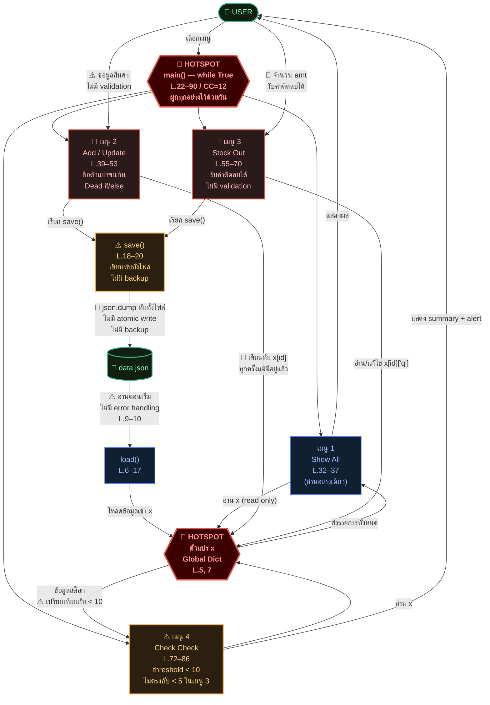

# กิจกรรม: The Architectural Detective
## Static Analysis + DFD พร้อม Hotspot อันตราย
### Inventory System v1.0 — `app_v1.py`

**กลุ่ม:** ___________________ | **วันที่:** ___________________

---

## ส่วนที่ 1 — Static Analysis

> วิเคราะห์โค้ด `app_v1.py` โดยไม่รันโปรแกรม (ดูจากโครงสร้างและรูปแบบการเขียนโค้ด)

### 1.1 Code Metrics

| Metric | ค่าที่วัดได้ | เกณฑ์ที่ดี | สถานะ |
|---|:---:|:---:|:---:|
| Lines of Code (LOC) | ~90 บรรทัด | < 300 | ✅ |
| จำนวนฟังก์ชัน | 3 (`load`, `save`, `main`) | — | ⚠️ น้อยเกินไป |
| Global Variables | 2 (`db`, `x`) | 0 | 🔴 |
| Cyclomatic Complexity ของ `main()` | ~12 | ≤ 10 | 🔴 สูงเกิน |
| ฟังก์ชันที่ยาวที่สุด | `main()` — ~70 บรรทัด | ≤ 20 | 🔴 |
| ความลึกของ Nesting สูงสุด | 4 ชั้น | ≤ 3 | 🔴 |
| Test Coverage | 0% | ≥ 80% | 🔴 |
| Type Hints | ไม่มีเลย | ควรมี | ⚠️ |

> **Cyclomatic Complexity** = จำนวนเส้นทางการทำงานที่เป็นไปได้  
> นับจาก: `while` (1) + `if/elif` 5 ทาง (5) + `if id in x` (1) + `if q >= amt` (1) + `if q < 5` (1) + `for k in x` × 2 (2) + `if q < 10` (1) = **≈ 12**

---

### 1.2 Code Smells ที่พบ

```
app_v1.py
│
├── L.4   db = "data.json"         ← Magic String (ควรเป็น constant)
├── L.5   x = {}                   ← 🔴 HOTSPOT: Global State
├── L.7   global x                 ← 🔴 HOTSPOT: global keyword
│
├── L.42  a = input(...)           ← Single-letter variable (a, b, c, d, e)
├── L.42  c = int(input(...))      ← 🔴 c หมายถึง qty แต่คีย์ "c" หมายถึง category
│
├── L.47  if a in x:               ← Dead Logic: if/else ทำงานเหมือนกันทุกตัวอักษร
├── L.49    x[a] = {...}           ↗
├── L.50  else:                    ↗
├── L.51    x[a] = {...}           ← ซ้ำกับบรรทัด 49 ทุกตัวอักษร
│
├── L.59  amt = int(input(...))    ← 🔴 ไม่มี validation ทั้ง type และ range
├── L.60  if x[id]['q'] >= amt:    ← 🔴 amt ติดลบก็ผ่าน condition นี้ได้
│
├── L.65  if q < 5:                ← 🔴 Magic Number (ทำไมถึง 5?)
├── L.81  if q < 10:               ← 🔴 Magic Number (ทำไมถึง 10?) ไม่ตรงกับ L.65
│
└── L.28  "4. Check Check"         ← Unclear Naming (ต้องเปิดโค้ดดูถึงจะรู้ว่าทำอะไร)
```

---

### 1.3 ปัญหาจำแนกตามประเภท

| ประเภท | จำนวนจุด | รายการ |
|---|:---:|---|
| 🔴 **Crash Risk** | 4 | ไม่มี try/except (L.9, 19, 42, 59), ตัดสต๊อกติดลบได้ (L.60) |
| 🔴 **Data Corruption** | 2 | ไม่มี atomic write (L.19), ไม่มี backup ก่อน overwrite |
| 🔴 **Logic Bug** | 2 | if/else ซ้ำซ้อน (L.47–51), threshold ไม่ตรงกัน (L.65 vs L.81) |
| ⚠️ **Maintainability** | 3 | Global state (L.5,7), ชื่อตัวแปรกำกวม (L.42), main() ยาวเกิน |
| ⚠️ **Readability** | 3 | Single-letter vars, Magic numbers, ชื่อเมนูไม่สื่อ |

---

## ส่วนที่ 2 — Data Flow Diagram (DFD)

> แสดงเส้นทางข้อมูล: เมนูไหน → อัปเดตตัวแปร `x` อย่างไร → บันทึกลงไฟล์ `data.json` ตอนไหน  
> 🔴 = **Hotspot อันตราย** | ⚠️ = จุดเสี่ยงระดับกลาง



---

## ส่วนที่ 3 — Hotspot อันตราย (อธิบายละเอียด)

### 🔴 HOTSPOT 1 — `global x` (L.5, 7)

```python
x = {}          # L.5 — dict ระดับ global
def load():
    global x    # L.7 — ทุกฟังก์ชันเข้าถึงได้โดยตรง
```

**ทำไมถึงอันตราย:** `load()`, `save()`, และทุกเมนูแชร์ `x` ตัวเดียวกัน  
แก้ผิดจุดเดียว → กระทบทุกเมนู → ข้อมูลเสียหายทั้งระบบ

---

### 🔴 HOTSPOT 2 — `main()` (L.22–90, CC=12)

```python
def main():
    load()          # ← ผูก load
    while True:     # ← ผูก event loop + ทุกเมนู + UI ไว้ในที่เดียว
        if choice == "2": ...
        elif choice == "3": ...
```

**ทำไมถึงอันตราย:** ฟังก์ชันเดียวทำ 4 หน้าที่ (loop + load + UI + logic)  
CC=12 → ต้อง test 12 เส้นทาง → แก้ผิดจุดใดจุดหนึ่ง → โปรแกรมไม่ทำงาน

---

### 🔴 HOTSPOT 3 — เมนู 2 Dead Logic + Naming (L.42–51)

```python
c = int(input("Enter Qty: "))           # c = จำนวน (qty)
if a in x:
    x[a] = {"n": b, "q": c, "p": d, "c": e}   # "c" = หมวดหมู่ (category)!
else:
    x[a] = {"n": b, "q": c, "p": d, "c": e}   # ← เหมือนกัน 100% = Dead Code
```

**ทำไมถึงอันตราย:** `c` ตัวแปร ≠ `"c"` คีย์ → อ่านสับสน → แก้โค้ดผิดได้ง่ายมาก

---

### 🔴 HOTSPOT 4 — เมนู 3 รับค่าติดลบ (L.59–61)

```python
amt = int(input("How many items out?: "))   # ไม่ตรวจ range
if x[id_to_cut]['q'] >= amt:               # amt = -5 ก็ผ่าน!
    x[id_to_cut]['q'] = x[id_to_cut]['q'] - amt  # 10 - (-5) = 15 ← สต๊อกเพิ่ม!
```

**ทำไมถึงอันตราย:** กรอก `-5` → สต๊อกเพิ่ม 5 โดยไม่มี warning → ข้อมูลผิดโดยไม่รู้ตัว

---

## สรุป Risk Map

```
🔴 CRITICAL — แตะต้องระวังสูงสุด
   global x       (L.5, 7)      ← ถ้าแก้ผิด ระบบล่มทั้งหมด
   main()         (L.22–90)     ← ถ้าแก้ผิด โปรแกรมไม่ทำงาน
   เมนู 2 logic   (L.42–51)     ← ถ้าแก้ผิด ข้อมูลเสียหาย
   เมนู 3 amt     (L.59–61)     ← ถ้าแก้ผิด สต๊อกผิดทั้งระบบ

⚠️  WARNING — ควรแก้ใน Sprint 1
   save()         (L.18–20)     ← ไม่มี atomic write / backup
   load()         (L.9–10)      ← ไม่มี error handling
   threshold      (L.65, 81)    ← < 5 vs < 10 ไม่ตรงกัน

✅  SAFE — ยังใช้งานได้ตามปกติ
   เมนู 1 Show All               ← อ่านอย่างเดียว ไม่แก้ x
   default data   (L.13–17)     ← fallback เมื่อไม่มีไฟล์
```

> ⚡ **กฎของ Architectural Detective:**  
> *"เขียน test ก่อนแตะ HOTSPOT เสมอ — มิฉะนั้นจะไม่รู้ว่าแก้แล้วระบบยังถูกต้องหรือไม่"*

---
*อ้างอิงจาก System Understanding Report — Code Archaeology Week 1*
