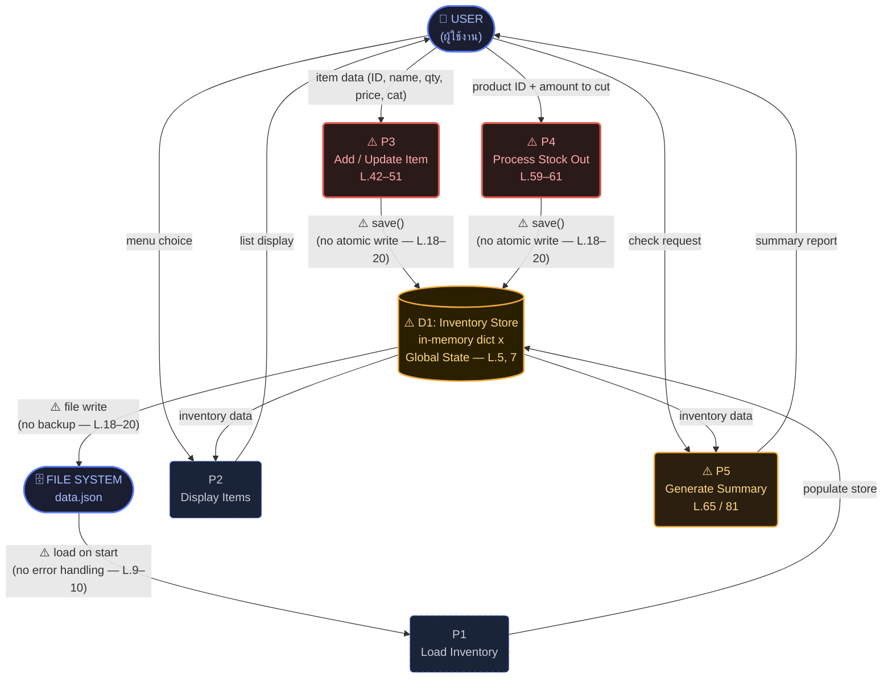

# Combined Report Phase 1.2
## Inventory System v1.0 — System Structure & Risk Analysis

**วิชา:** ENGSE225 + ENGSE202 | **Phase:** 1.2 — System Analysis  
| # | ชื่อ | ตำแหน่ง |
|---|---|---|
| 1 | ปวริศ คูณศรี | Project Manager |
| 2 | ตรัยรัตน์ วงศ์สิทธิ์ | Tech Lead |
| 3 | พนาวุฒน์ อภิปสันติ | QA / Tester |


> อ้างอิงจาก System Understanding Report (Code Archaeology — Week 1)

---

## สารบัญ

1. [Data Flow Diagram (Level 1)](#1-data-flow-diagram-level-1)
2. [Risk Register](#2-risk-register)
3. [ลิงก์ Jira Board](#3-ลิงก์-jira-board)

---

## 1. Data Flow Diagram (Level 1)

> แสดงการไหลของข้อมูลระหว่าง User ↔ กระบวนการหลัก ↔ Data Store ↔ File System  
> สัญลักษณ์ ⚠️ = จุดเสี่ยงที่ระบุไว้จาก Code Archaeology



### Legend

| สัญลักษณ์ | ความหมาย |
|---|---|
| `(["..."])` — กล่องมน | External Entity (User, File System) |
| `("...")` — วงรี | Process (กระบวนการ) |
| `[("...")]` — กระบอก | Data Store (D1: Inventory Store) |
| เส้นแดงตัวหนา | Data Flow ที่มีความเสี่ยง |
| ⚠️ | จุดเสี่ยงที่ระบุไว้จาก Code Archaeology พร้อมเลขบรรทัด |

### จุดเสี่ยงบน Diagram — สรุปต่อ Process

| Process | สีกรอบ | จุดเสี่ยงที่เกี่ยวข้อง | บรรทัดอ้างอิง |
|---|---|---|---|
| P1: Load Inventory | น้ำเงิน (ปกติ) | ไม่มี error handling เวลาอ่านไฟล์ | `L.9–10` |
| P2: Display Items | น้ำเงิน (ปกติ) | ไม่มีจุดเสี่ยงเฉพาะ (อ่านอย่างเดียว) | — |
| **P3: Add/Update** | **แดง (สูง)** | ชื่อตัวแปร `c` ชนกับคีย์ `"c"`, if/else ซ้ำซ้อน, ไม่มี validation | `L.42–51` |
| **P4: Stock Out** | **แดง (สูง)** | รับค่าติดลบได้ → สต๊อกเพิ่มแทนที่จะตัด, ไม่มี validation | `L.59–61` |
| **P5: Summary** | **เหลือง (กลาง)** | เกณฑ์ low-stock ไม่ตรงกับ P4 | `L.65 / 81` |
| **D1: Inventory Store** | **เหลือง (กลาง)** | Global State — ทุก process แชร์ `x` โดยตรง | `L.5, 7` |
| D1 → File System | เส้นแดง | ไม่มี backup, ไม่ใช้ atomic write | `L.18–20` |

---

## 2. Risk Register

> วิเคราะห์ความเสี่ยงจากการยุ่งกับโค้ดเก่า  
> คะแนน = Probability × Impact (H=3, M=2, L=1) | ⚡ RSK-01 ถึง RSK-05 ต้องจัดการก่อน Sprint 1

| Risk ID | ความเสี่ยง | ประเภท | Prob. | Impact | Score | แนวทางจัดการ | เจ้าของ |
|---|---|---|:---:|:---:|:---:|---|:---:|
| **RSK-01** | ❌ ไม่มี automated test เดิม → แก้โค้ดแล้วเกิด regression โดยไม่รู้ตัว | Technical | H | H | **9** | เขียน test ครอบคลุม flow หลักทุก menu **ก่อน** เริ่ม refactor (test-first) | QA |
| **RSK-02** | ❌ Global State (`global x`) — แก้จุดหนึ่งกระทบทุกจุด ตามรอย bug ยากมาก | Technical | H | H | **9** | แก้ incremental ทีละจุดพร้อม test กำกับทุกครั้ง ห้ามแก้หลายจุดพร้อมกัน | Tech Lead |
| **RSK-03** | ❌ ข้อมูลสูญหาย — `save()` เขียนทับทั้งไฟล์ ไม่มี backup | Technical | M | H | **6** | Implement atomic write (write tmp → rename) และ backup ก่อน overwrite | Developer |
| **RSK-04** | ❌ โปรแกรม crash จากการกรอกผิด — ไม่มี input validation เลย (`L.42–43, 59`) | Technical | H | M | **6** | เพิ่ม `try/except` + validate ทุก input ก่อน convert `int()`/`float()` | Developer |
| **RSK-05** | ⚠️ Requirement ไม่ชัดเจน — Add/Update ควร "บวกสต๊อก" หรือ "เขียนทับ"? | Process | M | H | **6** | ยืนยัน requirement กับอาจารย์ก่อนแก้ไข บันทึกผลการตัดสินใจลง Project Charter | PM |
| RSK-06 | ⚠️ สมาชิกในกลุ่มมีพื้นฐาน Python ไม่เท่ากัน → งานล่าช้า / code quality ไม่สม่ำเสมอ | Team | M | M | **4** | Tech Lead pair-program กับสมาชิกที่พื้นฐานน้อยกว่าในช่วงต้น ตั้ง coding standard ร่วมกัน | Tech Lead |
| RSK-07 | ⚠️ ไฟล์ `data.json` ของสมาชิกแต่ละคนอาจขัดแย้งกัน ถ้าไม่ตกลง convention | Process | M | M | **4** | ไม่ commit `data.json` จริง ใช้ `sample_data.json` ชุดกลางใน repo เป็น fixture | ทั้งทีม |
| RSK-08 | ⚠️ การแก้ไขกระทบฟังก์ชันเดิมที่ทำงานได้อยู่ (unintended regression) | Technical | M | M | **4** | รัน regression test ทุกครั้งก่อน merge ไม่ merge ถ้า test fail | QA |
| RSK-09 | 🔵 สมาชิกใช้ Python version ต่างกัน → อาจเกิด behavior ต่างกันในบางกรณี | Process | L | M | **2** | ตกลง Python version ร่วมกัน (แนะนำ ≥ 3.10) ระบุไว้ใน README | Tech Lead |

### Risk Score Summary

```
Score 9  (H×H) ████████████  RSK-01, RSK-02  — ⚡ Critical: จัดการทันที
Score 6  (M×H) ████████      RSK-03, RSK-04, RSK-05  — 🔴 High: Sprint 1
Score 4  (M×M) █████         RSK-06, RSK-07, RSK-08  — 🟡 Medium: Sprint 1–2
Score 2  (L×M) ██            RSK-09  — 🟢 Low: Sprint 2+
```

---

## 3. ลิงก์ Jira Board

**Jira Board URL:**
> `https://nicky2011abcd.atlassian.net/jira/software/projects/INV/boards`

**สถานะ WBS (INV-1 ถึง INV-16):**

- [x] WBS แตก task ครบ 16 รายการ (INV-1 ถึง INV-16)
- [x] มอบหมาย Assignee ให้สมาชิกทุกคนแล้ว
- [x] Priority และ Issue Type กำหนดครบ
- [ ] Sprint 1 planning เสร็จสมบูรณ์ _(กรอกวันที่เริ่ม Sprint)_

---

*ไฟล์นี้ generate จาก System Understanding Report ของกิจกรรม Code Archaeology Week 1*  
*อ้างอิงเลขบรรทัดจาก `main.py` — Inventory System v1.0*
