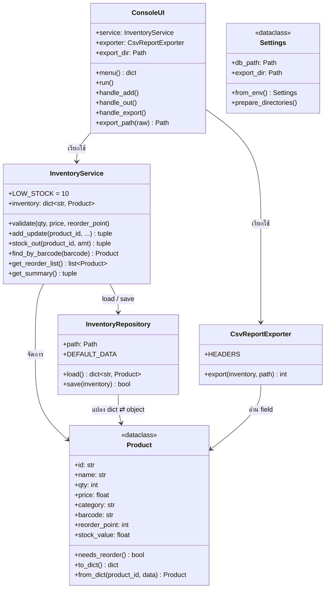

# System Operations & Maintenance Manual
## Mini Inventory System v2.0 — คู่มือการติดตั้ง ปฏิบัติการ และบำรุงรักษา (ISO/IEC 14764)

| | |
|---|---|
| เวอร์ชันเอกสาร | 1.0 (สัปดาห์ที่ 13) — ปรับปรุงต่อในสัปดาห์ที่ 14–15 |
| ใช้กับซอฟต์แวร์ | `v2.0.0-evolution` และใหม่กว่า |
| ผู้จัดทำ | พนาวุฒน์ อภิปสันติ (Tech Lead) · ตรัยรัตน์ วงษ์สิทธิ์ (QA) |
| ผู้อ่านเป้าหมาย | ผู้ดูแลระบบและนักพัฒนาที่จะรับช่วงต่อ — **อ่านเล่มนี้เล่มเดียวแล้วต้องทำงานต่อได้โดยไม่ต้องถามทีมเดิม** |

**เอกสารนี้ตอบ 4 คำถาม**

1. ระบบสร้างจากเทคโนโลยีอะไร → [บทที่ 1](#บทที่-1--system-overview) · [บทที่ 2](#บทที่-2--as-built-architecture)
2. ติดตั้งบนเครื่องใหม่อย่างไร → [บทที่ 3](#บทที่-3--deployment)
3. มีการแก้ไขอะไรไปบ้าง → [บทที่ 6](#บทที่-6--history--known-issues)
4. มีข้อจำกัดอะไรที่รู้อยู่แล้ว → [บทที่ 6.2](#62-known-issues-ข้อจำกัดที่รับทราบ)

---

## บทที่ 1 · System Overview

### 1.1 ขอบเขตระบบ (System Scope Statement)

โปรแกรม CLI สำหรับร้านค้าขนาดเล็ก ผู้ใช้ 1 คนต่อครั้ง ทำงานบนเครื่องผู้ใช้ เก็บข้อมูลเป็นไฟล์ JSON

| เมนู | หน้าที่ |
|---|---|
| 1 Show all | แสดงสินค้าทั้งหมด |
| 2 Add or Update | เพิ่ม/แก้ไขสินค้า (ID, ชื่อ, จำนวน, ราคา, หมวด, บาร์โค้ด, จุดสั่งซื้อ) — เขียนทับทั้งรายการ |
| 3 Out | ตัดสต๊อก เตือนเมื่อเหลือ < 10 และเมื่อถึงจุดสั่งซื้อของสินค้านั้น |
| 4 Inventory Summary | จำนวนชนิดสินค้า · มูลค่ารวม · รายชื่อสินค้าที่เหลือ < 10 |
| 5 Exit | ออกจากโปรแกรม |
| 6 Reorder List | สินค้าที่ถึงจุดสั่งซื้อแล้ว |
| 7 Export CSV | ส่งออกสินค้าทั้งหมดเป็น CSV เปิดใน Excel ได้ |

**อยู่นอกขอบเขต:** หลายผู้ใช้พร้อมกัน · ระบบขาย/ใบเสร็จ · การเชื่อมต่อเครือข่าย · ส่งอีเมล

### 1.2 เทคโนโลยี

| ส่วน | เทคโนโลยี |
|---|---|
| ภาษา | Python ≥ 3.10 (ทดสอบบน 3.10 · 3.12 · 3.13) |
| Runtime dependencies | **ไม่มี** — ใช้ standard library เท่านั้น (`json` `csv` `os` `tempfile` `pathlib` `dataclasses`) |
| ที่เก็บข้อมูล | ไฟล์ JSON 1 ไฟล์ (UTF-8) |
| ทดสอบ / สแกน | pytest · pytest-cov · flake8 · bandit (ดู `requirements-dev.txt`) |
| CI | GitHub Actions `.github/workflows/pytest.yml` |
| ระบบปฏิบัติการ | Windows · macOS · Linux |

---

## บทที่ 2 · As-Built Architecture

### 2.1 Class Diagram



`main()` เป็น **Composition Root** — ที่เดียวที่สร้างและประกอบทุกคลาสเข้าด้วยกัน:
`load_env_file()` → `Settings.from_env()` → `InventoryRepository` → `InventoryService` → `ConsoleUI`

### 2.2 Design Patterns

| Pattern | ใช้ที่ไหน | ประโยชน์ต่อการบำรุงรักษา |
|---|---|---|
| **Repository** | `InventoryRepository` | เปลี่ยนที่เก็บข้อมูล (เช่น SQLite) ได้โดยแก้คลาสเดียว ดูบทที่ 6.3 |
| **Dependency Injection** | `InventoryService(repository)` · `ConsoleUI(service, input_fn, print_fn, exporter)` | ทดสอบทุกชั้นแยกกันได้ด้วยของปลอม ไม่ต้องพิมพ์คีย์บอร์ดหรือเขียนไฟล์จริง |
| **Atomic Write** | `InventoryRepository.save()` | ไฟล์ข้อมูลเป็นของใหม่ทั้งหมดหรือของเดิมทั้งหมด ไม่มีสภาพครึ่ง ๆ |
| **Table-driven menu** | `ConsoleUI.menu()` | เพิ่มเมนูแก้ที่เดียว |

### 2.3 Data Schema — ไฟล์ฐานข้อมูล

```json
{
  "P100": {
    "n": "Milk",          // name       str
    "q": 4,               // qty        int  ≥ 0
    "p": 20.0,            // price      float ≥ 0
    "c": "Dairy",         // category   str
    "b": "885123456789",  // barcode    str  [CR-01] ว่างได้ ห้ามซ้ำกับสินค้าอื่น
    "r": 5                // reorder    int  ≥ 0 [CR-01] 0 = ไม่ได้ตั้ง
  }
}
```

key ชั้นนอกคือรหัสสินค้า · key ย่อ `n/q/p/c` คงไว้จาก v1.0 เพื่อให้อ่านไฟล์เก่าได้
ไฟล์ v1.x ที่ไม่มี `b`/`r` อ่านได้ทันที (เติม `""` และ `0`)

---

## บทที่ 3 · Deployment

### 3.1 Prerequisites

| รายการ | ขั้นต่ำ |
|---|---|
| Python | 3.10 ขึ้นไป พร้อม `pip` และ `venv` |
| Git | ใดก็ได้ |
| สิทธิ์ | เขียนไฟล์ในโฟลเดอร์โปรเจกต์ได้ |
| พื้นที่ | < 50 MB (รวม virtual environment และเครื่องมือทดสอบ) |
| เครือข่าย | ต้องใช้เฉพาะตอน `pip install` เครื่องมือทดสอบ — ตัวโปรแกรมไม่ใช้เครือข่าย |

### 3.2 ติดตั้งด้วยคำสั่งเดียว

```bash
git clone https://github.com/PeawZaZa/software_mnm.git
cd software_mnm
git checkout v2.0.0-evolution      # หรือแท็กล่าสุด
./setup.sh                         # macOS / Linux / Git Bash
```

Windows PowerShell:

```powershell
powershell -ExecutionPolicy Bypass -File setup.ps1
```

สคริปต์ทำ 5 ขั้น: ตรวจ Python ≥ 3.10 → สร้าง `.venv` → ติดตั้ง `requirements.txt` + `requirements-dev.txt`
→ คัดลอก `.env.example` เป็น `.env` (ถ้ายังไม่มี) → รัน smoke test
ใช้ `--runtime` (หรือ `-Runtime`) ถ้าไม่ต้องการเครื่องมือทดสอบ

### 3.3 ติดตั้งด้วยมือ (ถ้ารันสคริปต์ไม่ได้)

```bash
python -m venv .venv
source .venv/bin/activate              # Windows: .venv\Scripts\activate
pip install -r requirements.txt -r requirements-dev.txt
cp .env.example .env                   # Windows: copy .env.example .env
pytest -m smoke -q                     # ต้องได้ 3 passed
python app_v2.py
```

### 3.4 การตั้งค่า (`.env`)

| ตัวแปร | ค่าใน `.env.example` | ถ้าไม่ตั้ง |
|---|---|---|
| `INVENTORY_DB_PATH` | `data/inventory_db.json` | `data.json` ในโฟลเดอร์ที่สั่งรัน |
| `REPORT_EXPORT_DIR` | `exports` | CSV ไปตาม path ที่พิมพ์ในเมนู 7 |

- path สัมพัทธ์นับจาก**โฟลเดอร์ที่สั่งรัน** — รันจากโฟลเดอร์โปรเจกต์เสมอ
- โปรแกรมสร้างโฟลเดอร์ทั้งสองให้เองตอนเปิด
- ค่าใน environment จริงชนะค่าใน `.env` เช่น `INVENTORY_DB_PATH=test.json python app_v2.py`
- **ห้าม commit `.env`** (ถูก ignore ไว้แล้ว) — ระบบนี้ไม่มีรหัสผ่านหรือกุญแจลับ แต่ path อาจเปิดเผยชื่อผู้ใช้ของเครื่อง

### 3.5 ผลการติดตั้งบนสภาพแวดล้อมใหม่

ติดตั้งจาก `git clone` ลงโฟลเดอร์ว่างบน Windows 11 / Python 3.13.7 ใช้เวลา **25 วินาที** ผ่านทุกขั้น
ดู [Clean Environment Installation Report](week13/Clean_Environment_Installation_Report.md)

---

## บทที่ 4 · Verification

| ระดับ | คำสั่ง | ใช้เมื่อ | ผลที่ต้องได้ |
|---|---|---|---|
| Smoke | `pytest -m smoke -q` | ทุกครั้งหลังติดตั้ง/ย้ายเครื่อง | 3 passed (< 1 วินาที) |
| Full regression | `pytest -v --cov=app_v2 --cov-report=term-missing` | ก่อน merge ทุกครั้ง | ผ่าน 100% · coverage ≥ 90% |
| Lint | `flake8 . --count` | ก่อน merge | 0 |
| Security | `bandit -r . -x ./test_app.py,./test_app_v2.py,./test_hardening.py,./test_deployment.py` | ก่อน release | No issues |
| UAT | `python tools/run_uat.py` | ก่อน release | 8/8 |

บันทึกผลหลังบำรุงรักษาล่าสุด: [`week13/evidence/post_maintenance_test.log`](week13/evidence/post_maintenance_test.log)

---

## บทที่ 5 · Operations — Backup & Recovery

### 5.1 งานประจำวัน

| เวลา | งาน | วิธี |
|---|---|---|
| เปิดร้าน | เปิดโปรแกรม | `cd software_mnm` → activate `.venv` → `python app_v2.py` |
| ระหว่างวัน | ขาย/รับของ | เมนู 3 / เมนู 2 — ข้อมูลบันทึกทันทีทุกครั้ง ไม่ต้องกด save |
| ปิดร้าน | สำรองข้อมูล | คัดลอกไฟล์ข้อมูลตามข้อ 5.2 |
| ทุกเดือน | ส่งรายงานซัพพลายเออร์ | เมนู 6 ดูรายการต้องสั่ง → เมนู 7 ส่งออก CSV |

### 5.2 สำรองข้อมูล (Backup)

ข้อมูลทั้งหมดอยู่ในไฟล์เดียว (`INVENTORY_DB_PATH`) สำรองด้วยการคัดลอกไฟล์ตอนที่**ปิดโปรแกรมแล้ว**

```bash
mkdir -p backups
cp data/inventory_db.json "backups/inventory_db_$(date +%Y%m%d).json"
```

```powershell
New-Item -ItemType Directory -Force backups | Out-Null
Copy-Item data\inventory_db.json "backups\inventory_db_$(Get-Date -Format yyyyMMdd).json"
```

### 5.3 กู้คืน (Recovery Plan)

| อาการ | สาเหตุ | สิ่งที่ต้องทำ |
|---|---|---|
| `Warning: Database file is corrupted. Loading default data.` | ไฟล์ข้อมูลเสียทั้งไฟล์ | ⚠️ **ออกจากโปรแกรมทันที (เมนู 5) ห้ามเพิ่ม/ตัดสต๊อก** — การบันทึกครั้งถัดไปจะเขียนทับไฟล์เสียด้วยข้อมูลตั้งต้น (ดู KI-03) จากนั้นคัดลอกไฟล์ล่าสุดใน `backups/` กลับมาแทน |
| `Warning: skipping corrupted row 'X'` | ข้อมูลเสียบางแถว | ข้อมูลแถวอื่นใช้ได้ปกติ เปิดไฟล์ด้วย text editor แก้แถว X หรือเพิ่มสินค้านั้นใหม่ผ่านเมนู 2 |
| `Error: could not save data to disk.` | ดิสก์เต็ม / ไม่มีสิทธิ์เขียน / ไฟล์ถูกเปิดค้างในโปรแกรมอื่น | ระบบไม่ได้บันทึกการเปลี่ยนแปลงนั้น — แก้ต้นเหตุแล้วทำรายการซ้ำ |
| `Error: cannot write CSV file` | โฟลเดอร์ไม่มี / ไฟล์ CSV เปิดค้างใน Excel | ปิดไฟล์ใน Excel หรือตรวจ path แล้วส่งออกใหม่ |
| `ModuleNotFoundError` / `pytest: command not found` | ยังไม่ได้ activate `.venv` | `source .venv/bin/activate` (Windows: `.venv\Scripts\activate`) |

---

## บทที่ 6 · History & Known Issues

### 6.1 ประวัติการบำรุงรักษา

| เวอร์ชัน | ช่วง | สาระสำคัญ | รายละเอียด |
|---|---|---|---|
| `v1.0.0-baseline` | สัปดาห์ที่ 1–4 | โค้ดต้นฉบับ ฟังก์ชันเดียว ไม่มีเทสต์ | `app_v1.py` |
| v1.1 | Sprint 1 | แก้ 9 จุดเสี่ยง (INV-4…12) + เทสต์ 37 เคส | [CHANGELOG](../CHANGELOG.md) |
| v2.0 · v2.1 | Sprint 2 | Class-based · CR-01 · CR-02 · DEF-01/02/03 | [Defect Log](Defect_Log.md) |
| `v2.0.0-evolution` | Sprint 3 | Hardening · UAT-DEF-01 · Production baseline | [Maintenance Summary](week12/Maintenance_Summary_Report_ISO14764.md) |
| (สัปดาห์ที่ 13) | Phase 4 | ตั้งค่าผ่าน `.env` · setup script · smoke test | [Week 13](week13/README.md) |

### 6.2 Known Issues (ข้อจำกัดที่รับทราบ)

| รหัส | ข้อจำกัด | ผลกระทบ | ทางเลี่ยง |
|---|---|---|---|
| KI-01 | ใช้ได้ทีละ 1 คน ไม่มี file locking | เปิด 2 หน้าต่างพร้อมกัน หน้าต่างที่บันทึกทีหลังจะทับข้อมูลของอีกหน้าต่าง | เปิดโปรแกรมทีละหน้าต่าง |
| KI-02 | CSV ส่งออกสินค้าทั้งหมด ไม่ใช่เฉพาะสต๊อกต่ำ | ต้องกรองเองใน Excel | กรองคอลัมน์ `reorder_point` / `qty` · FB-01 ใน Future Backlog |
| KI-03 | ไฟล์ข้อมูลเสียทั้งไฟล์ → โหลดข้อมูลตั้งต้น แล้วการบันทึกครั้งถัดไปจะทับไฟล์เสีย | ถ้าผู้ใช้ทำรายการต่อ ข้อมูลเก่าจะกู้จากไฟล์นั้นไม่ได้ | ทำตามข้อ 5.3 · *แผนแก้: สำรองอัตโนมัติ `.bak` ในสัปดาห์ที่ 14* |
| KI-04 | DEF-04 ฟิลด์ที่หายจาก `data.json` ถูกเติม default โดยไม่เตือน | เกิดเฉพาะเมื่อแก้ไฟล์ด้วยมือ | อย่าแก้ไฟล์ข้อมูลด้วยมือ |
| KI-05 | GitHub Actions ไม่ทำงาน (บัญชีติด billing) | CI ไม่ตรวจอัตโนมัติ | รันคำสั่งบทที่ 4 บนเครื่องก่อน merge |
| KI-06 | รหัสสินค้าแยกตัวพิมพ์เล็ก-ใหญ่ (`p1` ≠ `P1`) | เพิ่มซ้ำโดยไม่ตั้งใจได้ | ใช้ตัวพิมพ์ใหญ่เสมอ |

### 6.3 แนวทางสำหรับนักพัฒนารุ่นต่อไป

| ต้องการ | ทำอย่างไร | แตะไฟล์/คลาส |
|---|---|---|
| เปลี่ยนจาก JSON เป็น SQLite/PostgreSQL | สร้างคลาสใหม่ที่มีเมธอด `load()` คืน `dict[str, Product]` และ `save(inventory)` คืน `bool` แล้วส่งให้ `InventoryService` แทน `InventoryRepository` ใน `main()` | คลาสใหม่ + `main()` เท่านั้น |
| เพิ่มฟิลด์ใน `Product` | เพิ่ม field พร้อม**ค่า default** · เพิ่ม key ย่อใน `to_dict()` · ใช้ `data.get(key, default)` ใน `from_dict()` · เพิ่มเทสต์อ่านไฟล์เก่าที่ไม่มี key นี้ | `Product` |
| เพิ่มเมนู | เพิ่ม handler ใน `ConsoleUI` และเพิ่ม 1 บรรทัดใน `menu()` | `ConsoleUI` |
| เปลี่ยนเกณฑ์สต๊อกต่ำ | แก้ `InventoryService.LOW_STOCK` | `InventoryService` |

**กติกาที่ต้องรักษา**

1. ห้ามเรียก `input()`/`print()` นอก `ConsoleUI` และห้ามอ่าน/เขียนไฟล์ข้อมูลนอก `InventoryRepository`
2. ทุก PR ต้องผ่าน flake8 · bandit · pytest coverage ≥ 90% และมีผู้ review ที่ไม่ใช่ผู้เปิด PR
3. ทุกการเปลี่ยน data model ต้องมีเทสต์ "ไฟล์ถูกไวยากรณ์แต่ค่าผิด" (บทเรียนจาก DEF-03)
