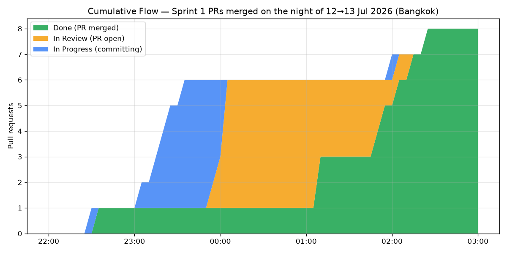
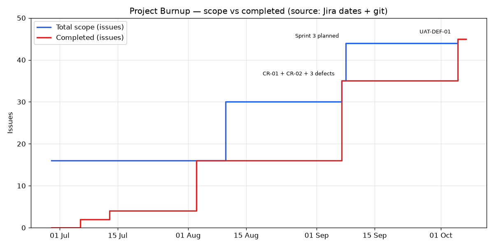

# รายงานวิเคราะห์ Cumulative Flow / Burnup Chart และบันทึกปิด Sprint 2
## ENGSE202 · สัปดาห์ที่ 11 — Flow Metrics & Scope Freeze · ชิ้นงานที่ 3

| | |
|---|---|
| ผู้จัดทำ | ปวริศ คูณศรี (Project Manager) |
| วันที่จัดทำ | 2026-10-05 |
| แหล่งข้อมูล | GitHub REST API (PR #1–#26) → [`../data/github_pull_requests.json`](../data/github_pull_requests.json) · วันที่ใน Jira `SAM1` · `git log` |
| ตัวเลขทั้งหมดคำนวณโดย | [`tools/pm_metrics.py`](../../tools/pm_metrics.py) → [`../data/metrics_summary.md`](../data/metrics_summary.md) |

> **หมายเหตุเรื่องข้อมูล** — Jira ของทีมไม่ได้บันทึกการเปลี่ยนสถานะรายใบอย่างสม่ำเสมอ
> (หลายใบถูกย้ายไป Done ทีเดียวตอนปิด sprint) ถ้าใช้ CFD จาก Jira อย่างเดียวจะเห็นแค่เส้นกระโดดขั้นเดียว
> ทีมจึงสร้าง CFD จาก**วงจรชีวิตของ Pull Request** ซึ่งมี timestamp จริงทุกขั้น
>
> | สถานะใน CFD | นิยามจากข้อมูล GitHub |
> |---|---|
> | In Progress | ตั้งแต่ commit แรกของสาขา จนถึงตอนเปิด PR |
> | In Review | ตั้งแต่เปิด PR จนถึงตอน merge |
> | Done | หลัง merge |
>
> แนบภาพ CFD จาก Jira (Reports → Cumulative flow diagram) ประกอบด้วยตามขั้นตอนใน [`../JIRA_SETUP.md`](../JIRA_SETUP.md)

---

## 1. Cumulative Flow Diagram — พบคอขวดที่ด่าน Code Review จริง

### 1.1 อ่านกราฟ

งานทั้งหมดของ Sprint 1 เกิดขึ้นใน**คืนเดียว** คือ 22:26 น. วันที่ 12 ก.ค. ถึง 02:24 น. วันที่ 13 ก.ค.
(วันสุดท้ายของ sprint ตามแผน) และกราฟแสดงอาการคอขวดตรงตามตำราทุกข้อ

| ช่วงเวลา | สิ่งที่เห็นในกราฟ | ความหมาย |
|---|---|---|
| 23:00–00:00 | แถบสีน้ำเงิน (In Progress) หนาขึ้นเรื่อย ๆ | Developer และ Tech Lead เขียนโค้ดพร้อมกัน 5 สาขา |
| 00:00–01:05 | **แถบสีส้ม (In Review) บวมเป็น 5 PR ทันที** แต่แถบเขียวแบนราบ | ทุกคนเปิด PR ห่างกันไม่ถึง 10 นาที แต่**ไม่มีใคร merge ได้เลย 1 ชั่วโมง** |
| 01:05–02:05 | แถบเขียวค่อย ๆ ขยับทีละขั้น | PR ถูก merge ทีละใบ เพราะทุกสาขาแก้ `app_v2.py` ไฟล์เดียวกัน ต้อง merge `develop` กลับเข้าสาขาเพื่อแก้ conflict ทีละรอบ (commit `49ee650` `69bb6a9` `45d6d62`) |

### 1.2 ตัวเลขจริง

| PR | งาน | ผู้เปิด | รอ Review (นาที) |
|---|---|---|---:|
| #2 | Input validation | Dev | 75 |
| #3 | Refactor global state | Tech Lead | 68 |
| #4 | Fix logic bugs | Tech Lead | **122** |
| #5 | Fix negative stock | Dev | 110 |
| #6 | Fix naming & I/O | Dev | 103 |
| | **เฉลี่ย** | | **96** |

**WIP สูงสุดในช่อง Review = 5 PR** เมื่อเวลา 00:02 น. วันที่ 13 ก.ค.

### 1.3 ตรวจสอบด้วย Little's Law

$$\text{Lead Time} = \frac{\text{WIP}}{\text{Throughput}}$$

| ตัวแปร | ค่า | ที่มา |
|---|---|---|
| WIP ในช่อง Review | 5 PR | นับจากกราฟ |
| Throughput ของด่าน Review | 5 PR ใน ~2 ชม. = 2.5 PR/ชม. | merge ครั้งแรก 01:07 ถึงครั้งสุดท้าย 02:02 + เวลาแก้ conflict |
| **Lead time ที่ทำนาย** | 5 ÷ 2.5 = **2 ชม. (120 นาที)** | |
| **Lead time ที่วัดได้จริง** | เฉลี่ย 96 นาที · สูงสุด 122 นาที | ตารางข้อ 1.2 |

ตัวเลขทำนายกับของจริงอยู่ในระดับเดียวกัน ยืนยันว่า**ความล่าช้ามาจากคิวที่ด่าน Review**
ไม่ได้มาจากการเขียนโค้ดช้า (ช่วง In Progress ของ PR #2–#6 เฉลี่ยแค่ 42 นาทีต่อสาขา)

### 1.4 อาการตรงข้ามใน Sprint 2 — Review ถูกข้ามไปเลย

| PR | งาน | รอ Review (นาที) | ผู้ merge |
|---|---|---:|---|
| #23 | Sprint 2 refactor (7 commits) | 1 | ผู้เปิด PR เอง |
| #24 | CR-01 | 0 | ผู้เปิด PR เอง |
| #25 | CR-02 | 0 | ผู้เปิด PR เอง |
| #26 | Bug fixes | 0 | ผู้เปิด PR เอง |

Sprint 2 ไม่มีคิวที่ด่าน Review เลย แต่ไม่ใช่เพราะ flow ดีขึ้น — **เพราะไม่มีการ Review**
PR ทั้ง 4 ใบถูก merge โดยคนเปิดเองภายใน 0–1 นาที ซึ่งขัดกับ DoD ข้อ "ผ่าน Peer Code Review"

> **บทเรียน:** CFD ที่ "ไหลลื่น" ไม่ได้แปลว่ากระบวนการดีเสมอไป ต้องดูคู่กับว่าด่านคุณภาพถูกข้ามหรือไม่

### 1.5 มาตรการแก้ไข

| # | มาตรการ | ตั้งค่าที่ไหน | แก้ปัญหา |
|---|---|---|---|
| 1 | **WIP Limit ช่อง In Review = 3** ถ้าเต็ม ทุกคนหยุดเขียนโค้ดใหม่แล้วมาช่วยรีวิว | Jira → Board settings → Columns → Max | คิว 5 PR ใน Sprint 1 |
| 2 | **Branch Protection: ต้องมีผู้อนุมัติ 1 คนที่ไม่ใช่ผู้เปิด PR** | GitHub → Settings → Branches → `develop`, `main` | Self-merge ใน Sprint 2 |
| 3 | เปิด PR ทันทีที่งานเสร็จ ไม่รอวันสุดท้าย | Working agreement | งานกระจุกคืนเดียว |
| 4 | แยกงานที่แก้ไฟล์เดียวกันให้ทำต่อกันเป็นลำดับ | Sprint planning | Conflict ใน `app_v2.py` |

---

## 2. Burnup Chart — ขอบเขตที่ขยายตัวกับงานที่ส่งมอบ

> Jira ของทีมยังไม่เปิด Story Points ([`JIRA_SETUP.md`](../JIRA_SETUP.md) หมายเหตุท้ายเอกสาร)
> จึงวัดเป็น**จำนวน issue** แทน Story Points

### 2.1 Sprint 2 Delivery Benchmark

| ขอบเขตงาน (Scope Milestone) | Issues | สถานะ |
|---|---:|---|
| Initial Scope — SAM1-28…43 (Class-based refactor) | 14 | ส่งมอบครบ 100% 🟢 |
| CR-01 Scope Added — Barcode + Reorder Point (SAM1-44) | +1 | ส่งมอบครบ 100% 🟢 |
| CR-02 Scope Added — CSV Export (SAM1-45) | +1 | ส่งมอบครบ 100% 🟢 |
| Defects จาก Bug Bashing — DEF-01/02/03 (SAM1-46…48) | +3 | แก้ครบ 100% 🟢 |
| **Total Scope Completed** | **19 / 19** | **100%** 🏆 |

### 2.2 สิ่งที่ Burnup บอกแต่ Burndown ไม่บอก

1. **ขอบเขตโตขึ้น 36% ใน Sprint 2** (14 → 19 ใบ) — ถ้าดู Burndown อย่างเดียวจะเห็นแค่เส้นที่ไม่ลดลงเลย
   และอาจเข้าใจผิดว่าทีมไม่ทำงาน ทั้งที่จริงคือมีงานเพิ่มเข้ามา
2. **เส้น Completed เป็นขั้นบันไดสูง ไม่ใช่เส้นลาด** ทั้ง Sprint 1 (4 → 16 ในวันที่ 3 ส.ค.)
   และ Sprint 2 (16 → 35 ในวันที่ 7 ก.ย.) — ยืนยันปัญหางานกระจุกปลายรอบตรงกับ CFD ข้อ 1
3. ช่วง 8 ก.ย. – 4 ต.ค. เส้นแบนทั้งคู่ — Sprint 3 วางแผนไว้แล้วแต่ยังไม่มีงานไหนเสร็จจนถึง 5 ต.ค.

---

## 3. EVM ณ สิ้นสุด Sprint 2

> 🔶 ค่า AC ยังเป็น**ค่าประมาณ** เพราะสมาชิกยังไม่ได้ Log Work ใน Jira
> ค่าทั้งหมดแก้ได้ที่ [`../data/project_metrics.json`](../data/project_metrics.json) แล้วรัน `python tools/pm_metrics.py`

| ตัวแปร | สูตร | ค่า (บาท) |
|---|---|---:|
| PV | (แผน 60 ชม. + กันชนที่อนุมัติ 7 ชม.) × 300 | **20,100** |
| EV | PV × 19/19 งานเสร็จ | **20,100** |
| AC | 67 ชม. × 300 🔶 | **20,100** |
| SV = EV − PV | | **0** |
| CV = EV − AC | | **0** |
| SPI = EV ÷ PV | | **1.00** |
| CPI = EV ÷ AC | | **1.00** 🔶 |

**การแปลผลอย่างระมัดระวัง**

- **SPI = 1.00 เป็นค่าจริง** — Sprint 2 ปิดวันที่ 7 ก.ย. ตรงกับวันสิ้นสุดตามแผน
  แต่ตามข้อสังเกตเรื่องข้อจำกัดของ EVM ใน [`../EVM_Analysis.md`](../EVM_Analysis.md)
  SPI ที่วัด ณ วันจบ sprint จะเป็น 1.00 เสมอถ้างานเสร็จครบ ต้องดูคู่กับ Burnup ที่เห็นว่างานเสร็จทั้งหมดในวันสุดท้าย
- **CPI = 1.00 ยังใช้ตัดสินไม่ได้** — เพราะ AC ประมาณจากชั่วโมงตามแผนบวกกันชน CPI จึงออกมาเป็น 1.00 โดยโครงสร้าง
  ทีมต้องกรอกชั่วโมงจริงก่อนส่งรายงาน Final EVM ในสัปดาห์ที่ 12

---

## 4. บันทึกปิด Sprint 2 (Sprint 2 Review)

### 4.1 Demo ต่อหน้าอาจารย์ (Sponsor)

| Demo | สิ่งที่สาธิต | คำสั่ง / เมนู |
|---|---|---|
| 1 · CR-01 | เพิ่มสินค้าพร้อม Barcode + Reorder Point แล้วตัดสต๊อกให้เกิดการเตือน | `python app_v2.py` → เมนู 2 → เมนู 3 → เมนู 6 |
| 2 · CR-02 | ส่งออก `.csv` แล้วเปิดใน Excel ภาษาไทยไม่เพี้ยน | เมนู 7 |
| 3 · Quality | pytest และ flake8 ผ่าน 100% | `pytest -v` · `flake8 .` |

สคริปต์สาธิตทีละขั้นอยู่ใน [`../week12/UAT_Test_Scenarios_and_Signoff.md`](../week12/UAT_Test_Scenarios_and_Signoff.md)

### 4.2 ตรวจเกณฑ์ Definition of Done — ตามจริง

| เกณฑ์ DoD | ผล | หลักฐาน |
|---|---|---|
| โค้ดทั้งหมดผสานเข้า `develop` | ✅ ผ่าน | PR #23–#26 merged |
| PyTest Full Suite 100% Pass | ✅ ผ่าน (บนเครื่อง) | 148 passed ณ วันปิด sprint |
| PyTest บน **CI/CD** | ❌ **ไม่ผ่าน** | GitHub Actions ไม่ถูกรันเพราะบัญชีติด billing |
| ผ่าน Peer Code Review บน GitHub | ❌ **ไม่ผ่าน** | PR #23–#26 merge โดยผู้เปิดเองภายใน 1 นาที (ข้อ 1.4) |
| สมาชิกทุกคน Log Work ใน Jira | ❌ **ไม่ผ่าน** | ยังไม่มีชั่วโมงจริง — AC ใน EVM จึงเป็นค่าประมาณ |

**ผลการตรวจรับ: Accepted with conditions** — ซอฟต์แวร์ทำงานได้ครบตามขอบเขต
แต่กระบวนการไม่ผ่าน 3 ข้อ ทีมรับเงื่อนไขว่าจะ

1. ตั้ง Branch Protection บังคับ 1 approval ก่อนเริ่มงาน Sprint 3
2. ให้ Tech Lead review ย้อนหลัง PR #23–#26 และบันทึกความเห็นใน PR
3. ทุกคน Log Work ย้อนหลัง Sprint 2 และ 3 ภายในสัปดาห์ที่ 12 (ใช้คำนวณ Final EVM)

### 4.3 Velocity

| Sprint | Commitment | Completed | หมายเหตุ |
|---|---:|---:|---|
| Sprint 1 | 16 | 16 | ปิดช้ากว่าแผน 21 วัน |
| Sprint 2 | 14 | 19 | รับงานเพิ่มกลาง sprint 5 ใบ ปิดตรงวัน |

---

## 5. เปิด Sprint 3 — Hardening & Release

**เป้าหมาย:** ทำระบบให้พร้อมส่งมอบ — ไม่มีฟีเจอร์ใหม่ (Scope Freeze)

| รหัส | งาน | ผู้รับผิดชอบ (A) | ประมาณการ |
|---|---|---|---:|
| S3-01 (SAM1-49) | Flake8 clean-up + lint config | Tech Lead | 4 ชม. |
| S3-02 (SAM1-50) | Bandit security scan + รายงาน | QA | 4 ชม. |
| S3-03 (SAM1-51) | Refactor code smells | Developer | 4 ชม. |
| S3-04 (SAM1-52) | Atomic I/O + exception handling | Developer | 4 ชม. |
| S3-05 (SAM1-53) | Integration test + coverage ≥ 90% + CI gates | QA | 4 ชม. |
| S3-06 (SAM1-54) | UAT scenarios · ดำเนินการ · ใบ sign-off | QA | 4 ชม. |
| S3-07 (SAM1-55) | แก้ข้อบกพร่องจาก UAT | Developer | 4 ชม. |
| S3-08 (SAM1-56) | Release `v2.0.0-evolution` (PR → `main`, tag, CHANGELOG) | Tech Lead | 4 ชม. |
| S3-09 (SAM1-57) | Maintenance Summary Report (ISO/IEC 14764) | Project Manager | 4 ชม. |
| | **รวม** | | **36 ชม.** |

> ✅ **ทำใน Jira แล้ว (2026-10-05 ผ่าน Atlassian connector):** Sprint 2 ปิดแล้ว · สร้างงาน SAM1-49…57 เข้า Sprint 3
> · Start Sprint 3 วันที่ 2026-09-08 → 2026-09-21 · เพิ่ม UAT-DEF-01 (SAM1-58) ระหว่าง sprint
> · ย้ายงานเก่าที่ Done แล้ว 10 ใบที่ค้างอยู่ใน Sprint 3 กลับไป Backlog เพื่อไม่ให้ velocity เพี้ยน
> ⬜ ยังต้องแคปหน้าจอ Velocity Report เอง
