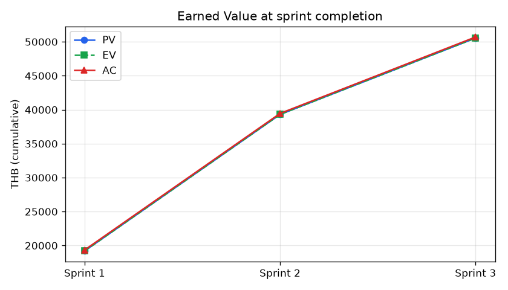
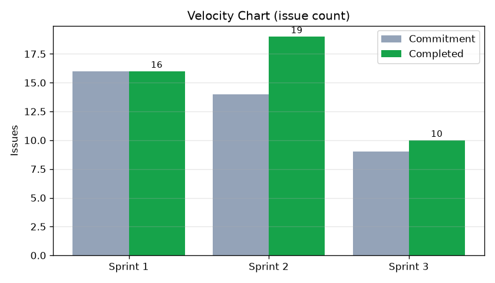

# รายงาน Final EVM และ Velocity ตลอด 3 Sprints
## ENGSE202 สัปดาห์ที่ 12 — Final EVM & Procurement Close-out · ส่วนที่ 2

| | |
|---|---|
| ผู้จัดทำ | ปวริศ คูณศรี (Project Manager) |
| วันที่ตัดข้อมูล | 2026-10-05 (ปิด Sprint 3) |
| ข้อมูลตั้งต้น | [`../data/project_metrics.json`](../data/project_metrics.json) |
| ผลคำนวณ | [`../data/metrics_summary.md`](../data/metrics_summary.md) (สร้างโดย `python tools/pm_metrics.py`) |

> ## 🔶 หลักการประมาณ Actual Cost (AC)
>
> สมาชิกยังไม่ได้ Log Work ใน Jira จึงไม่มีชั่วโมงทำงานจริง ทีมตัดสินใจ (2026-10-05) ใช้หลัก
> **AC = ชั่วโมงตามแผน + เงินกันชนที่เบิกจริง + งานทำซ้ำที่มีหลักฐานใน git เท่านั้น**
> ไม่เดาชั่วโมงที่ไม่มีหลักฐาน ผลคือ CPI จะใกล้ 1.00 โดยโครงสร้าง — **ใช้ยืนยันได้ว่าไม่มีหลักฐานการใช้งบเกิน
> แต่ยังพิสูจน์ไม่ได้ว่าใช้งบตรงแผน** จนกว่าจะกรอกชั่วโมงจริง
>
> รายงาน EVM สัปดาห์ที่ 9–10 ใช้สมมติฐานต่างออกไป (AC 24 ชม. ณ 13 ก.ค. สำหรับ snapshot กลาง Sprint 1)
> ตัวเลขในรายงานนี้แทนที่ฉบับนั้นสำหรับการสรุปปิดเฟส

---

## 1. ตัวแปรตั้งต้น

| Sprint | งานในแผน | งานเพิ่มระหว่างทาง | ชม. ตามแผน | กันชนที่อนุมัติ | AC (ชม.) | เกณฑ์ AC |
|---|---:|---:|---:|---:|---:|---|
| Sprint 1 | 16 | 0 | 64.0 | 0.0 | 64.5 | แผน + งานทำซ้ำ PR #14→#15→#19 (~32 นาที) |
| Sprint 2 | 14 | 5 | 60.0 | 7.0 | 67.0 | แผน + กันชน CR-02 และ DEF-01/02/03 |
| Sprint 3 | 9 | 1 | 36.0 | 1.5 | 37.5 | แผน + กันชน UAT-DEF-01 |

อัตราค่าแรง 300 บาท/ชม. · ค่าเครื่องมือจริง 0 บาท ([Procurement Close-out](Procurement_Closeout_and_Reserve_Settlement.md))

## 2. Final EVM ณ วันเสร็จจริง

| ตัวแปร | สูตร / ที่มา | ค่า |
|---|---|---:|
| **PV** (BAC รวม) | Σ (ชม.แผน + กันชนที่อนุมัติ) × 300 | **50,550 บาท** |
| **EV** | งานผ่าน DoD ครบ 45 / 45 ใบ | **50,550 บาท** |
| **AC** | Σ AC × 300 + เครื่องมือ 0 | **50,700 บาท** 🔶 |
| SV = EV − PV | | **0** |
| CV = EV − AC | | **−150 บาท** |
| **SPI** = EV ÷ PV | 50,550 ÷ 50,550 | **1.00** |
| **CPI** = EV ÷ AC | 50,550 ÷ 50,700 | **0.997** 🔶 |

### รายสปรินต์

| Sprint | PV | EV | AC | CV | SPI | CPI | ส่งช้ากว่าแผน |
|---|---:|---:|---:|---:|---:|---:|---:|
| Sprint 1 | 19,200 | 19,200 | 19,350 | −150 | 1.00 | 0.992 | **21 วัน** |
| Sprint 2 | 20,100 | 20,100 | 20,100 | 0 | 1.00 | 1.000 | 0 วัน |
| Sprint 3 | 11,250 | 11,250 | 11,250 | 0 | 1.00 | 1.000 | **14 วัน** |
| **รวม** | **50,550** | **50,550** | **50,700** | **−150** | **1.00** | **0.997** | |

## 3. ⚠️ SPI = 1.00 ข้างบนไม่ได้แปลว่าตรงเวลา

EVM ที่วัด ณ วันงานเสร็จจะให้ SPI = 1.00 เสมอ เพราะงานเสร็จครบแล้ว (ข้อจำกัดที่ทีมบันทึกไว้ตั้งแต่ [EVM สัปดาห์ที่ 9–10](../EVM_Analysis.md#️-ข้อจำกัดของ-evm-ที่เห็นได้จากตารางนี้))
มุมมองที่ถูกต้องคือวัด ณ **วันสิ้นสุดตามแผน**ของแต่ละ sprint

| Sprint | วันสิ้นสุดตามแผน | งานเสร็จ ณ วันนั้น | EV ณ วันนั้น | **SPI จริง** |
|---|---|---|---:|---:|
| Sprint 1 | 2026-07-13 | 4 / 16 | 4,800 | **0.25** 🔴 |
| Sprint 2 | 2026-09-07 | 19 / 19 | 20,100 | **1.00** 🟢 |
| Sprint 3 | 2026-09-21 | 0 / 10 | 0 | **0.00** 🔴 |

**Sprint 3 ไม่มีงานเสร็จเลยภายในกรอบเวลาที่วางไว้** — ไม่มี commit ใดระหว่าง 8–21 ก.ย.
งานทั้งหมดเกิดขึ้นวันที่ 5 ต.ค. ซ้ำรูปแบบเดียวกับ Sprint 1 ที่งานกระจุกช่วงท้าย
มีเพียง Sprint 2 ที่ปิดตรงวัน แต่ก็ทำทั้งหมดในคืนสุดท้ายเช่นกัน ([Burnup สัปดาห์ที่ 11](../week11/Flow_Metrics_and_Sprint2_Closure.md#2-burnup-chart--ขอบเขตที่ขยายตัวกับงานที่ส่งมอบ))

> **ข้อสรุปที่ตรงไปตรงมา:** โครงการส่งมอบขอบเขตครบ 100% ภายในงบ แต่**ไม่ตรงเวลา** 2 ใน 3 sprints
> ปัญหาหลักของทีมคือ*การกระจายงานตลอดรอบ* ไม่ใช่ความสามารถทางเทคนิค

## 4. Velocity Trend

| Sprint | Commitment | Completed | เป้าหมาย | ลักษณะงาน |
|---|---:|---:|---|---|
| Sprint 1 | 16 | 16 | Refactoring core + bug fixes | ผ่าตัดโค้ดเดิม |
| Sprint 2 | 14 | **19** | Class-based + CR-01 + CR-02 | ความเร็วสูงสุด รับงานเพิ่ม 5 ใบ |
| Sprint 3 | 9 | 10 | Hardening · UAT · Release | งานคุณภาพ ไม่มีฟีเจอร์ใหม่ |
| **เฉลี่ย** | | **15.0** ใบ/sprint | | |

> นับเป็นจำนวน issue เพราะ Jira ยังไม่เปิด Story Points — issue แต่ละใบขนาดไม่เท่ากัน
> ค่าเฉลี่ยนี้จึงใช้วางแผนคร่าว ๆ ได้ แต่ไม่ควรใช้เป็นตัวเลขผูกมัด

## 5. Epic Burndown

| Epic | ขอบเขต | สถานะ |
|---|---|---|
| Epic 1 — Refactoring | Sprint 1 (16) + SAM1-28…43 (14) | ✅ ปิดครบ |
| Epic 2 — Evolution | CR-01 · CR-02 · DEF-01/02/03 · UAT-DEF-01 | ✅ ปิดครบ |
| Epic 3 — Hardening & Release | S3-01…S3-09 | ✅ งานเสร็จ — รอ UAT sign-off และ tag บน `main` ก่อนปิดใบ S3-08 |

> ⬜ **ต้องดึงจาก Jira:** Reports → **Velocity Report** และ **Epic Burndown** แล้วแคปภาพแนบ
> ภาพ Velocity จาก Jira จะใช้ข้อมูลเดียวกับตารางข้อ 4 ถ้า sprint ถูก Complete ครบ

## 6. การนำตัวเลขไปใช้ต่อ

| ใช้ใน | ตัวเลข |
|---|---|
| Phase 3 Completion Certificate | SPI 1.00 (at completion) · CPI 0.997 🔶 · Scope 100% |
| KPI Scorecard สัปดาห์ที่ 13 | SPI · CPI · การส่งช้า 21 / 0 / 14 วัน |
| ROI สัปดาห์ที่ 14 | AC รวม 50,700 บาท |
